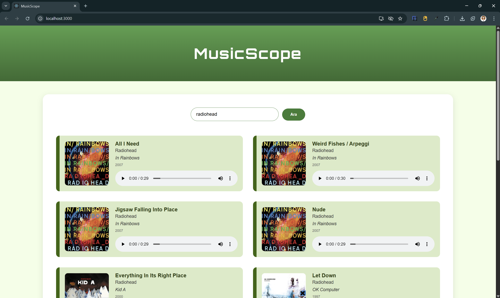

MusicScope🎵

MusicScope, React ile geliştirdiğim müzik arama uygulamasıdır. Müzik araması sanatçı veya şarkı ismi girilerek yapılır, şarkıya ait albüm bilgisi çıkış yılı ve kısıtlı bir ön dinlemesi yapılabilir. Verileri iTunes Search API'den çektim.

---

Kullandığım API

[iTunes Search API](https://developer.apple.com/library/archive/documentation/AudioVideo/Conceptual/iTuneSearchAPI/)

---

Proje Nasıl Çalıştırılır?

1. .zip Dosyası İndirme:
Repoda "Code" kısmında sağ üstteki yeşil "code" butonundan dosyalar .zip olarak indirilir.

2. Dosyayı .zip içinden çıkarıp proje klasörünü Terminal veya VS Code üzerinden açın.
" cd ../../BTE311-Final-main "

3. Gerekli paketleri yükleme:
Git Bash'te?
" npm install "

4. Uygulamayı çalıştırma:
" npm start "

5. Tarayıcı'da otomatik olarak açılacaktır. 
" http://localhost:3000 "

---

Ekran Görüntüsü

---
Tuana Bozdağ
Web Tabanlı Programlama
@2025
